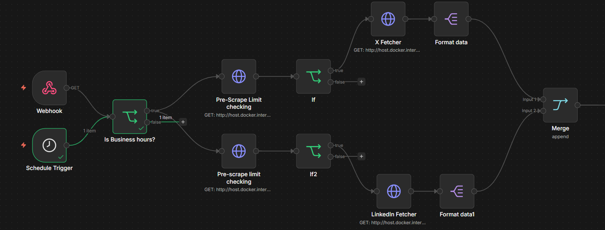
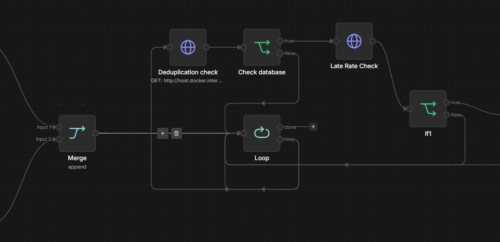
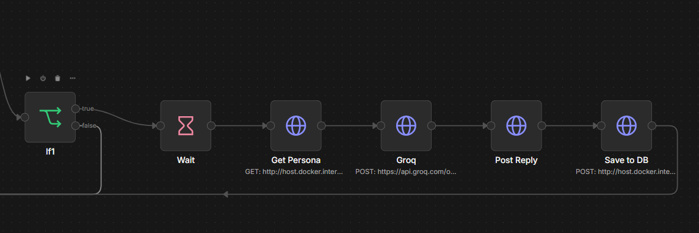

#  Auto Bidding Bot (LinkedIn & X)

An intelligent, automated system designed to detect job opportunities on LinkedIn and X (Twitter) and automatically post personalized, AI-generated bids. This project combines the orchestration power of **n8n** with the browser automation capabilities of **Playwright** and the speed of **Groq AI**.

##  Key Features
- **Multi-Platform Support**: Scrapes and posts on both LinkedIn and X.
- **AI-Powered Bidding**: Generates unique, 3-4 sentence human-like bids using Groq (Llama 3).
- **Smart Scheduling**: Operates only during business hours to simulate human activity.
- **Rate Limiting**: Strictly adheres to platform limits (10-15/day for LinkedIn, 5-10/day for X).
- **Deduplication**: Uses a SQLite database to ensure no post is ever replied to twice.
- **Stealth Mode**: Uses persistent browser sessions and random delays to minimize ban risk.

##  Tech Stack
- **Orchestration**: n8n
- **Browser Automation**: Python + Playwright
- **AI Generation**: Groq API (Llama 3)
- **Database**: SQLite (Deduplication & History)
- **Backend API**: FastAPI
- **Frontend Dashboard**: React (Vite)

##  Architecture & Workflow

The system follows a modular architecture where **n8n** manages the logic flow, while the **Python Backend** performs the actual web interactions.

### Visual Workflow Breakdown

#### Part 1: Trigger & Platform Fetching


#### Part 2: Deduplication & Looping


#### Part 3: AI Generation & Automation


### n8n Workflow Walkthrough

#### 1. Trigger & Safety Checks
- **Triggers**: The workflow starts via a **Scheduled Trigger** (every 2 hrs) or a manual **Webhook** from the dashboard.
- **Business Hours Filter**: A code node checks if the current time is between 9 AM and 6 PM. If not, the process stops to avoid suspicious "bot-like" midnight activity.
- **Pre-Scrape Limit Check**: Queries the FastAPI backend to see if the daily limit for X or LinkedIn has already been reached.

#### 2. Data Fetching
- **Platform Fetchers**: Calls the Python scrapers via API to gather the latest posts based on user-defined keywords (e.g., "looking for developer").
- **Data Formatting**: Standardizes the scraped data from both platforms into a unified JSON format.

#### 3. Deduplication & Filtering
- **Deduplication Check**: For each post found, the workflow queries the SQLite database.
- **Check Database**: If the `post_url` already exists in `bids.db`, it is discarded.
- **Late Rate Check**: A final check to ensure that even during the loop, we don't exceed the daily cap.

#### 4. AI Generation & Posting
- **Loop**: Processes each unique, new post one by one.
- **Wait Node**: Implements a random delay (3-5 minutes) between posts to simulate human reading/typing time.
- **Get Persona**: Fetches your professional "Persona" (skills, tone, experience) from the backend.
- **Groq AI**: Sends the post content + your persona to Llama 3 to generate a personalized bid.
- **Post Reply**: Calls the Python Playwright script to navigate to the URL and type out the comment.
- **Save to DB**: Records the successful bid in SQLite to prevent future duplicates.

##  Dashboard & Personalization

The project includes a **React-based Dashboard** that serves as the central control hub for the automation.


### Integration & Personalization
- **Persona Management**: You can define your professional title, years of experience, and a specific "tone of voice." This data is synchronized with `persona.json` on the backend.
- **Workflow Synergy**: When n8n triggers a bid, it first fetches this persona data. This ensures the AI (Groq) generates comments that sound like *you*, mentioning your specific tech stack and matching your preferred professional tone.
- **Search Configuration**: Allows real-time updates to search keywords, which are immediately used by the Playwright scrapers in the next cycle.
- **Dynamic Feedback**: Includes real-time toast notifications and loading states to provide immediate feedback on bot triggers and configuration saves.
- **Live Activity Log**: Monitors the SQLite `bids.db` to show a live feed of all successful bids, complete with direct links to the social media posts.

##  Project Structure
```text
├── workflow/                  # n8n Workflow JSON export
├── backend/
│   ├── main.py                # FastAPI Entry Point
│   ├── db.py                  # Database Utilities
│   ├── scraper_x.py           # Playwright logic for X
│   ├── scraper_linkedin.py    # Playwright logic for LinkedIn
│   ├── bids.db                # SQLite Database
│   ├── keywords.json          # Search configuration
│   └── persona.json           # User professional identity
├── frontend/                  # React Dashboard
├── Dockerfile                 # Containerization
└── docker-compose.yml         # Orchestration for n8n & Backend
```

##  Setup & Installation

### Prerequisites
- Docker & Docker Compose
- Python 3.10+
- Groq API Key


Follow these steps to get the entire system running on your local machine.

### 1. Backend Setup (Python)
The backend manages the scrapers, database, and API.

1.  **Create a Virtual Environment**:
    ```bash
    python -m venv .venv
    ```
2.  **Activate the Environment**:
    -   **Windows**: `.\.venv\Scripts\activate`
    -   **Mac/Linux**: `source .venv/bin/activate`
3.  **Install Dependencies**:
    ```bash
    pip install -r requirements.txt
    ```
4.  **Install Playwright Browsers**:
    ```bash
    playwright install chromium --with-deps
    ```
5.  **Run the Server**:
    ```bash
    uvicorn backend.main:app --host 0.0.0.0 --port 8000 --reload
    ```

### 2. Frontend Setup (React)
The dashboard provides the user interface for configuration and activity logs.

1.  **Navigate to Frontend**:
    ```bash
    cd frontend
    ```
2.  **Install Dependencies**:
    ```bash
    npm install
    ```
3.  **Start Development Server**:
    ```bash
    npm run dev
    ```

### 3. Docker Setup (n8n)
We use Docker to run n8n, which orchestrates the entire workflow.

1.  **Start n8n**:
    ```bash
    docker-compose up -d
    ```
2.  **Access n8n**: Open your browser and go to `http://localhost:5678`.

### 4. Initial Authentication (CRITICAL)
Before the bot can run automatically, you must log in manually to LinkedIn and X once to save your session cookies.

1.  **Toggle Headless Mode**: Open `backend/scraper_x.py` and `backend/scraper_linkedin.py`. Set `headless=False`.
2.  **Run Standalone for Login**:
    -   Run the scripts manually.
    -   **IMPORTANT**: On the first run, if the browser opens to a search page and you aren't logged in, simply navigate to `linkedin.com` or `x.com` in that same window.
3.  **Manual Login**: Perform your login (and 2FA if enabled) manually.
4.  **Save Session**: Once you see your feed, close the browser window. The session data is now securely saved in the `browser_profile_*` folders.
5.  **Go Headless**: Set `headless=True` back in the scripts for fully automated background operation.

### 5. Importing the Workflow
1.  In n8n, click the **menu (three dots)** -> **Import from File**.
2.  Select `workflow/autobidder_workflow.json`.
3.  **Configure Groq**: In the "Groq" node, add your API key.
4.  **Configure Webhook**: Copy your n8n Production Webhook URL and paste it into the **Settings** page of the React Dashboard.

##  Risk Mitigation (Anti-Ban)
- **Session Reuse**: We use `launch_persistent_context` so we never have to log in repeatedly.
- **Human Typing**: Playwright types the AI-generated comment character-by-character with slight delays.
- **Randomized Delays**: n8n introduces variable wait times between actions.
- **Low Volume**: We stay well below the aggressive detection thresholds of both platforms.

---
